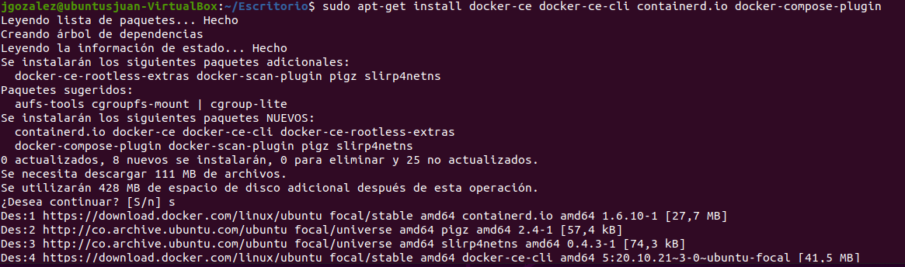

# Practica 1
**Por** *Juan Camilo Gonzalez Mulato*
## 1. Configuración del entorno: El estudiante deberá configurar su dispositivo de elección para ejecutar una imagen virtualizada de Linux, este será un suministro importante para el resto de prácticas.
### Se instaló la imagen de Linux Ubuntu y posteriormente se realizo las diferentes configuraciones del entorno.

## 2. Instalar docker
- Verifico si alguna version anterior de docker no este instalada

- Actualizo el apt índice del paquete:

- Se hace la instalación Docker Engine, containerd y Docker Compose.

- Verifico que la instalación de Docker Engine sea exitosa ejecutando la hello-worldimagen:

## 3. Reconocimiento de herramientas de red: Identificar configuración de red por medio del comando ip e ifconfig. Identificar servicios y puertos ocupados en el sistema con los comandos ss, netstat y lsof.
- Comando ip 
Aqui nos muestra todas las direciones ip que esta utilizando el sistema. 

- Comando ifconfig
Aqui nos muestra  varias interfaces que ha creado el sistemas con sus respetivas direciones ip conectadas

Ahora utilizando los comandos ss, netstat y lsof para mirar que puertos y servicios está utilizando el sistema. 

## 4. Identificar servicios desplegados: El estudiante deberá identificar 5 servicios diferentes listados por las herramientas de red y determinar a qué aplicaciones posiblemente están relacionados.
 con el comando lsof | lees se se puede visualizar los servicios

